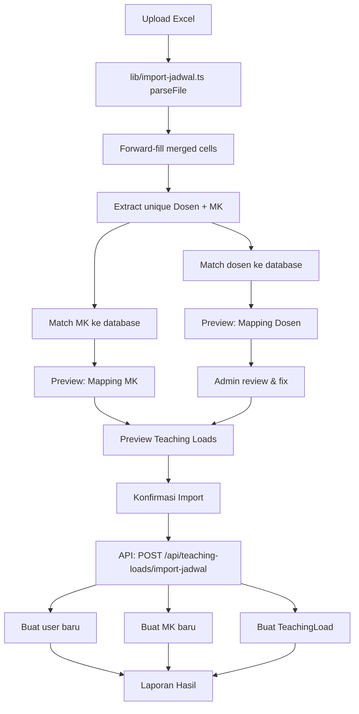

# Import Jadwal Kelas — Unified Import (User + Mata Kuliah + Teaching Load)

## Overview

Single-file import untuk admin membuat semua data perkuliahan dalam satu proses: file Excel dari akademik berisi data dosen, mata kuliah, dan penugasan dosen ke mata kuliah sekaligus.

## Problem

Saat ini admin harus:
1. Import User (file terpisah)
2. Import Mata Kuliah (file terpisah)
3. Assign teaching load manual satu per satu

Padahal akademik sudah punya **satu file Excel** (`Jadwal Kelas Auto.xlsm`) yang berisi jadwal lengkap. Proses manual ini memakan waktu dan rawan error.

## Scope

| # | Item | Deskripsi |
|---|------|-----------|
| 1 | Upload & Parse | Baca file XLSM/XLSX dari akademik, parse 13 kolom |
| 2 | Matching Dosen | Cocokkan nama/NIDN ke database, dengan fallback fuzzy |
| 3 | Buat User Baru | Auto-generate username/email/password untuk dosen baru |
| 4 | Matching & Buat MK | Cocokkan kode MK ke database, buat jika baru |
| 5 | Buat Teaching Load | Assign dosen ke MK untuk semester terpilih |
| 6 | Preview Interaktif | Admin review & perbaiki mismatch sebelum impor |
| 7 | Laporan Hasil | Statistik impor: dibuat, dilewati, error |

## Deferred (Future)

- Update data dosen existing (NIDN, nama) dari file — cukup create new saja, update manual
- Import multiple semester sekaligus
- Auto-detect semester dari header file ("SEMESTER GENAP 2025-2026")

## File Excel Source

**Lokasi:** `docs/Jadwal Kelas Auto.xlsm`

**Struktur (13 kolom):**

| # | Col | Isi | Contoh |
|---|-----|-----|--------|
| 1 | NO | Nomor urut dosen (merged) | 1, 2, ... |
| 2 | NAMA DOSEN | Nama lengkap dengan gelar (merged) | "Ahmad Muchlison, M.A." |
| 3 | KODE MK | Kode mata kuliah (bisa hyperlink SIAKAD) | "C02211202" |
| 4 | MATA KULIAH | Nama mata kuliah | "Kewarganegaraan" |
| 5 | SKS | Jumlah SKS | 2 |
| 6 | SEMESTER | Semester (Romawi) | "II", "IV", "VI" |
| 7 | PRODI | Kode prodi | "IAT", "SPI", "BSA" |
| 8-12 | KELAS, RUANG KELAS, HARI, WAKTU, RUANG | Info jadwal | — |
| 13 | FILTER | Formula Excel | — |

**Karakteristik file:**
- Row 1-4: Header info (title, fakultas, semester, empty)
- Row 5: Header kolom ("NO", "NAMA DOSEN", ...)
- Row 6+: Data
- Kolom NO dan NAMA DOSEN: merged secara visual (nilai hanya di baris pertama tiap dosen, sisanya null)
- KODE MK cell type: bisa `string` biasa atau `{text, hyperlink}` dari SIAKAD
- NIDN: opsional (akan ditambahkan sebagai kolom baru oleh admin)
- Total ±410 baris, ±79 dosen unik, 6 prodi (IAT, IH, SPI, BSA, AFI, IPII)
- Semester Romawi: II=2, IV=4, VI=6 — dimapping ke semester aktif

## Architecture



### Matching Logic (Prioritas)

```
DOSEN:
  1. NIDN match (paling akurat) → auto-link ✅
  2. Name exact match (untuk tanpa NIDN) → auto-link ✅
  3. Name fuzzy match >70% → flag ⚠️, admin review
  4. No match → ❌, admin pilih: [Buat Baru] atau [Pilih User]

MATA KULIAH:
  1. Kode MK match → auto-link ✅
  2. Kode MK baru → 🆕, akan dibuat
```

### Normalisasi

**Nama dosen:**
```
"Ahmad Muchlison, M.A." → ambil "Ahmad Muchlison"
"Dr. H. Aang Saeful Milah, M.A" → ambil "Dr. H. Aang Saeful Milah"
→ lowercase → "ahmad muchlison" / "dr h aang saeful milah"
```

**Kode MK:**
```
Cell type 5 (rich text): { text: "C04211442", hyperlink: "..." } → "C04211442"
Cell type 3 (string): "C02211202" → "C02211202"
```

**Semester Romawi:**
```
"II" → semester ganjil/genap dari konteks file header
"IV"
"VI"
→ Kolom SEMESTER di-ignore, semester ditentukan dropdown admin
```

**Forward-fill merged cells:**
```
Row 6:  NO=1, NAMA="Ahmad Muchlison"
Row 7:  NO=null, NAMA=null → forward-fill NO=1, NAMA="Ahmad Muchlison"
Row 8:  NO=null, NAMA=null → forward-fill NO=1, NAMA="Ahmad Muchlison"
```

### Unique Key Extraction

Setiap baris sudah di-forward-fill → extract unique tuples:

**Unique Dosen:** `(nama_normalized, nidn)` → digunakan untuk mapping
**Unique MK:** `(kode_mk, nama_mk, sks, prodi_code)` → digunakan untuk mapping
**Teaching Loads:** setiap baris (dosen_id, mk_id, semester_id) → 1 TL per baris

Note: Dosen yang mengajar MK yang sama untuk kelas berbeda → multiple TL dengan user+mk yang sama (sesuai skema `@@unique([userId, courseId, semesterId])`).

## UI Flow — 5-Step Dialog

### Komponen:

**File:** `components/admin/teaching-loads/import-jadwal-dialog.tsx`

**Pattern:** Mengikuti pola `import-dialog.tsx` yang sudah ada (upload → preview → result), diperluas menjadi 5 step.

```
┌─────────────────────────────────────────┐
│ Import Jadwal Kelas                      │
│                                         │
│ ○ Upload ● Dosen ○ MK ○ TL ○ Hasil     │ ← Step indicator
│                                         │
│ [konten step]                            │
│                                         │
│            [Kembali] [Lanjut/Import]    │
└─────────────────────────────────────────┘
```

### Step 1 — Upload & Pilih Semester
- Drop file / klik upload
- Dropdown pilih **semester** (kombo dari database, hanya semester aktif)
- File info: nama file, ukuran, jumlah baris setelah parsing
- Tombol "Lanjut"

### Step 2 — Mapping Dosen (interaktif)
- Tabel: Nama di Excel | NIDN | Hasil Pencocokan | Tindakan
- Setiap baris mewakili 1 unique dosen
- Status per baris:
  - ✅ (auto-link by NIDN/nama)
  - ⚠️ (fuzzy match, perlu review)
  - ❌ (tidak ditemukan)
- Kolom Tindakan:
  - ✅ → dropdown "Ganti User" (kalau mau ubah)
  - ⚠️ → dropdown "Pilih User" (searchable, daftar semua user DOSEN)
  - ❌ → tombol "Buat Baru" + dropdown "Pilih User"
- Tombol "Lanjut" setelah semua status resolved (tidak ada ⚠️/❌)

### Step 3 — Mapping Mata Kuliah
- Tabel: Kode MK | Nama MK | SKS | Prodi | Status (✅ sudah ada / 🆕 baru)
- Non-interaktif (kode MK sudah pasti)
- Tombol "Lanjut"

### Step 4 — Ringkasan Teaching Loads
- Tabel: Nama Dosen | MK | SKS | Prodi | Kelas
- Ringkasan di atas: X dosen, Y MK unik, Z teaching load
- Tombol "Import"

### Step 5 — Hasil
- Statistik: Dosen dibuat, Dosen dilewati, MK dibuat, MK dilewati, TL dibuat, Error
- Detail error per item (jika ada)
- Tombol "Selesai"

## API Endpoint

**Route:** `POST /api/teaching-loads/import-jadwal`

**Request:** `multipart/form-data` dengan fields:
- `file`: File Excel (.xlsm/.xlsx)
- `semesterId`: ID semester target

**Response:**
```json
{
  "success": true,
  "data": {
    "usersCreated": 5,
    "usersSkipped": 74,
    "coursesCreated": 10,
    "coursesSkipped": 60,
    "teachingLoadsCreated": 120,
    "errors": ["Baris 50: Kode MK tidak valid: ..."]
  }
}
```

**Backend:** `app/api/teaching-loads/import-jadwal/route.ts`

**Helper:** `lib/import-jadwal.ts` — parsing, normalisasi, matching logic

## Database

Tidak ada perubahan schema. Entitas yang terlibat:

- `User` — dibuat jika NIDN/nama tidak match
- `Course` — dibuat jika kode MK tidak match
- `TeachingLoad` — selalu dibuat baru (unique: userId + courseId + semesterId)
- `Semester` — dipilih oleh admin, tidak dibuat

### Auto-generate User Baru

| Field | Value |
|-------|-------|
| `username` | `slugify(nama_lowercase)` — "ahmad-muchlison" |
| `name` | Nama asli dari Excel |
| `email` | `username@example.com` |
| `password` | bcrypt("password123") — hardcoded default |
| `role` | DOSEN |
| `nidn` | Dari Excel (jika ada) |
| `prodiId` | Dari mapping kode prodi → ID prodi |
| `isActive` | true |

### Auto-generate MK Baru

| Field | Value |
|-------|-------|
| `code` | Dari Excel (KODE MK) |
| `name` | Dari Excel (MATA KULIAH) |
| `sks` | Dari Excel |
| `prodiId` | Dari mapping kode prodi |
| `semesterId` | Dari dropdown admin |
| `totalMeeting` | 16 (default) |

### Teaching Load Baru

| Field | Value |
|-------|-------|
| `userId` | ID user (existing atau baru) |
| `courseId` | ID course (existing atau baru) |
| `semesterId` | Dari dropdown admin |
| `isTeam` | false (default) |

## Error Handling

| Skenario | Handling |
|----------|----------|
| File bukan Excel (.xlsm/.xlsx) | Tolak, pesan: "Format file tidak didukung" |
| File tidak punya sheet | Tolak, pesan: "File tidak memiliki sheet data" |
| Kode prodi tidak dikenal | Skip baris, catat error |
| Kode MK tidak valid | Skip baris, catat error |
| Semester tidak dipilih | Step 1 wajib pilih semester |
| Ada ⚠️/❌ di Step 2 | Tombol Lanjut dinonaktifkan sampai resolved |
| Duplicate TL (user+mk+semester) | Skip, laporkan di hasil |
| Gagal create user/MK/TL | Catat error per item, lanjutkan batch |

## Files Changed

### New files:
| # | File | Purpose |
|---|------|---------|
| 1 | `lib/import-jadwal.ts` | Parse, normalize, matching logic |
| 2 | `app/api/teaching-loads/import-jadwal/route.ts` | POST handler |
| 3 | `components/admin/teaching-loads/import-jadwal-dialog.tsx` | 5-step dialog |

### Modified files:
| # | File | Change |
|---|------|--------|
| 1 | `components/admin/teaching-loads/load-table.tsx` | Add "Import Jadwal" button |
| 2 | `app/(dashboard)/dashboard/admin/teaching-loads/page.tsx` | Pass onSuccess refresh |

## Dependencies

No new dependencies needed. `exceljs` already installed.

## Implementation Order

1. Create `lib/import-jadwal.ts` — core parsing & matching logic
2. Create API route `POST /api/teaching-loads/import-jadwal`
3. Create `import-jadwal-dialog.tsx` — 5-step dialog
4. Modify `load-table.tsx` + `page.tsx` — add button
5. Test with actual file
6. TypeScript check
7. Commit
